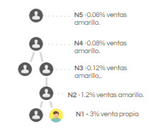

## Desarrollo para calcular comisiones y bonos para un equipo multinivel.

La estructura del equipo es la siguiente, donde los que están arriba son los líderes de los que están abajo. 
image.png

### Punto1. 
Primero se deben programar las comisiones para la venta.
Este gráfico muestra las comisiones para una venta realizada por el vendedor amarillo que está en el nivel más básico del equipo.
Esta misma lógica aplica para todos los integrantes del equipo. 
Por ejemplo si el que está en el nivel 2 (N2) realiza una venta recibe una comisión de 3% 
y el que está en el nivel superior de 1.2%, y 
el siguiente de 0.12%...etc. 

N1 = 3%
N2 = 1.2%
N3 = 0.12%
N4 = 0.08%
N5 = 0.06%

### Punto 2. bonos
Además aplican los siguientes bonos para los líderes.

Bono por meta propia (aplica max uno de los siguientes)
Si la persona vende $5,000 recibe $150
Si la persona vende $10,000 recibe $200  
Si la persona vende $15,000 recibe $300  
Si la persona vende $25,000 recibe $400  

Bono de quincena
Si la persona vende $5,000 o más en los primeros quince días del mes recibe $100

Bono de liderazgo (aplica max uno)
Si el equipo, incluyendo al líder vende $20,000 en el mes recibe $150
Si el equipo, incluyendo al líder vende $40,000 en el mes recibe $250
Si el equipo, incluyendo al líder vende $60,000 en el mes recibe $350
Si el equipo, incluyendo al líder vende $80,000 en el mes recibe $500
  
Bono trimestral(aplica max uno) 
Si el equipo, incluyendo al líder vende $45,000 o más por tres meses consecutivos recibe $350
Si el equipo, incluyendo al líder vende $65,000 o más por tres meses consecutivos recibe $500
Si el equipo, incluyendo al líder vende $85,000 o más por tres meses consecutivos recibe $650
Si el equipo, incluyendo al líder vende $100,000 o más por tres meses consecutivos recibe $1000   

### Restricciones
No existe ninguna restricción para la comisión del 3% por ventas propias. Pero para acceder a las comisiones del equipo y a los bonos de liderazgo es necesario cumplir los siguientes requisitos:
* Para el líder N2 (que tiene un nivel a su cargo): venta propia > $5,000, venta del equipo > $35,000
* Para el líder N3 (que tiene dos niveles a su cargo): venta propia > $8,000, venta del equipo > $60,000, numero de lideres n2 en su equipo >= 1
* Para el líder N4 (que tiene tres niveles a su cargo): venta propia > $8,000, venta del equipo > $120,000, numero de lideres N2 en su equipo >= 2,  numero de lideres N3 en su equipo >= 1,   
* Para el líder N5 (que tiene cuatro niveles a su cargo): venta propia > $6,000, venta del equipo > $240,000, numero de lideres N2 en su equipo >= 3,  numero de lideres N3 en su equipo >= 2,  numero de lideres N4 en su equipo >= 1,   

## Casos de prueba
C1 = V N1 = $1000
N1 = 3%     30
N2 = 1.2%   12
N3 = 0.12%  1.2
N4 = 0.08%  0.8
N5 = 0.06%  0.6
